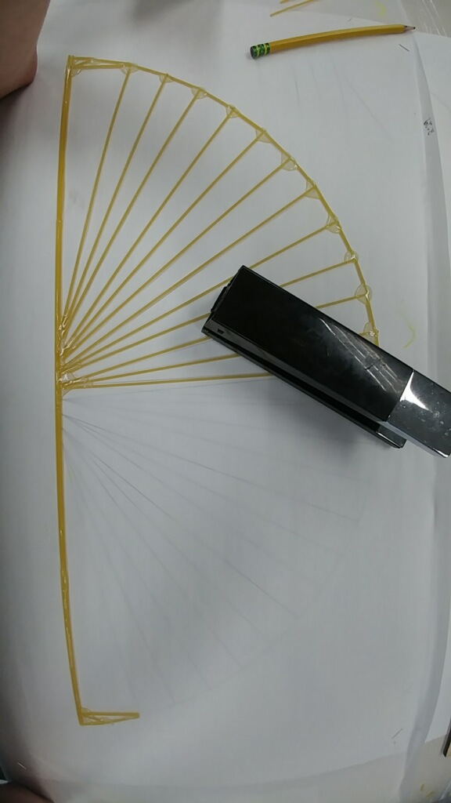
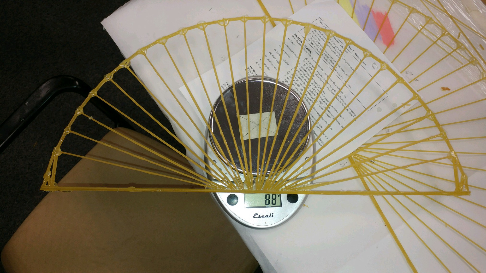
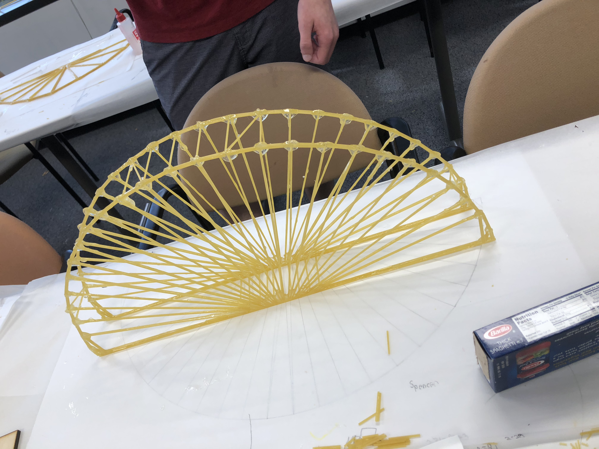
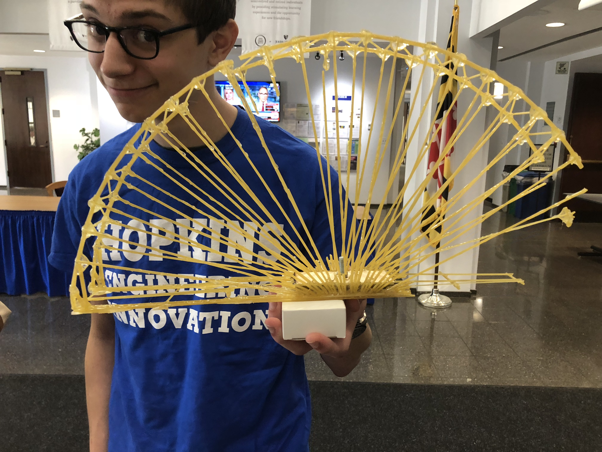

# JHU Engineering Innovation Summer Program: Spaghetti Bridge Project

## Overview

I (Eashan Siddalingaiah), Jared Boyd, Andrei Kotiarov, and Spencer Schenk were tasked with creating a bridge which weighed under 250 grams, was shorter than 25 centimeters, was at least 5 centimeters wide, spanned a distance of at least 50 centimeters and supported at least 5 kilograms only out of spaghetti and epoxy.

## Process

We started off modelling possible designs in an online bridge simulator. We wanted to make sure that the long spaghetti strands were under tension and the shorter spaghetti strands were under compression becuase long spaghetti is stronger in tension and weak in compression. Once we finalized our design we drew a scale template of our design on a large sheet of paper and started building one half of the bridge.

Half of the bridge being constructed:

We then weighed the half bridge to make sure it was below 125 grams. It ended up as 88 grams, so we continued and built the second half of the bridge.

Weighing half of the bridge:

We then connected the two halves on the bridge and made sure it weighed less thean 250 grams.

Mostly Finished Bridge:

## Results

On competition day our bridge was able to hold 14 kilograms, which was significantly more than the other bridges and over 50 times its own weight.

Clip of bridge testing in slow motion:

Picture of bridge after breaking:

